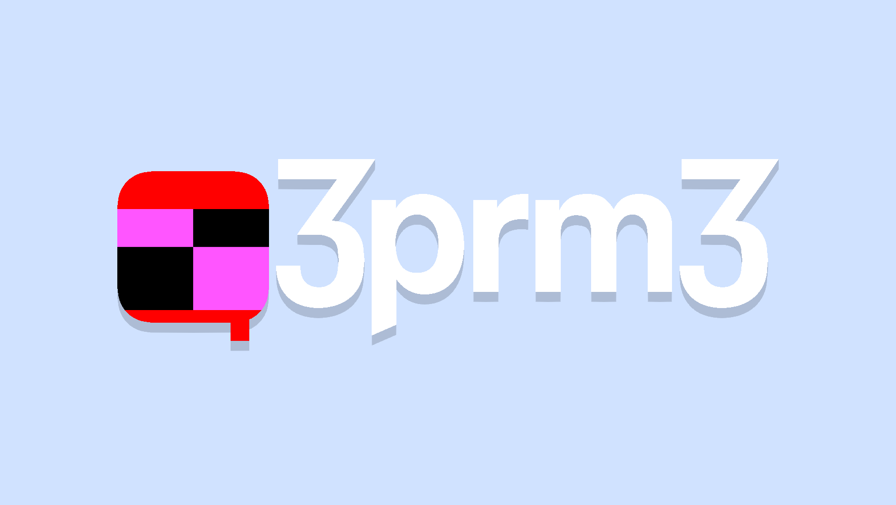

<link href="site/css/style.min.css" rel="stylesheet" type="text/css" media="all">

<h1>The repository for the site <a href="https://threepremthree.neocities.org">https://threepremthree.neocities.org</a></h1>

This repo contains the site's code and some extras so it edited conveniently from VSCode and deployed to Neocities. 

[HTML version](https://threepremthree.neocities.org/readme.html)